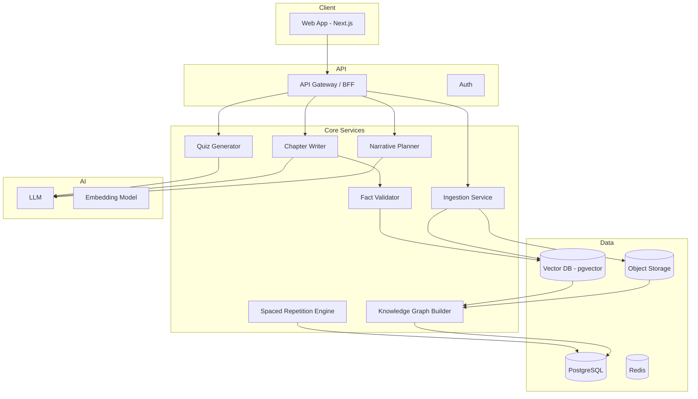

# Custom Book — 技术架构

## 1. 总体架构



## 2. 推荐技术栈（MVP）

| 层 | 选型 | 理由 |
|----|------|------|
| 前端 | Next.js 15 + React | SSR、流式阅读体验 |
| UI | Tailwind + shadcn/ui | 快速构建阅读器 |
| 后端 | Next.js API Routes / FastAPI | MVP 可 monolith |
| DB | PostgreSQL + pgvector | 关系数据 + 向量检索 |
| 队列 | BullMQ / Inngest | 异步章生成 |
| 存储 | S3 / R2 | PDF 原件 |
| Auth | Clerk / Supabase Auth | 快速集成 |
| LLM | Claude / GPT-4o + 小模型 | 质量与成本分层 |
| 部署 | Vercel + Railway/Supabase | 低运维 |

## 3. 核心数据模型

```typescript
Book {
  id, userId, title, genre, styleProfile, status
  sourceDocumentId, bookBibleId
}

SourceDocument {
  id, rawText, chunks[], metadata
}

KnowledgeNode {
  id, bookId, label, definition, prerequisites[], sourceChunkIds[]
}

BookBible {
  id, bookId
  worldSetting, characters[], plotArc
  conceptMappings[] // { nodeId, metaphor, recurringMotif }
}

ChapterPlan {
  id, bookId, index, title
  targetNodeIds[], plotBeat, cliffhanger
}

Chapter {
  id, planId, content
  paragraphs[] // { text, anchoredNodeIds[], sourceChunkIds[] }
}

MasteryRecord {
  userId, nodeId, score, lastReviewedAt, nextReviewAt
}
```

## 4. 生成流水线

```
Upload
  → Chunk (500-1000 tokens) → Embed → Extract Knowledge Graph
  → User confirms graph → Generate Book Bible
  → Generate Chapter Plans
  → For each chapter:
        Retrieve relevant chunks + prior summary
        → Draft (streaming)
        → Validate facts against chunks
        → Generate quiz
        → Update mastery on submit
        → Plan next chapter with weak nodes emphasis
```

## 5. RAG 防幻觉策略

1. **Extract**：只从 chunk 抽概念，带 `sourceChunkId`
2. **Write**：每段声明 `anchoredNodeIds`
3. **Validate**：LLM + 检索做「陈述 ↔ 原文」一致性打分
4. **低于阈值**：重写该段或插入知识卡片

## 6. 成本与性能

| 环节 | 策略 |
|------|------|
| 大纲 / Bible | 一次生成，缓存 |
| 章节 | 流式输出，边读边生成下一章 |
| 长材料 | 只检索本章相关 chunks |
| 估算 | 10 章材料约 $0.5～$2 LLM 成本 |
