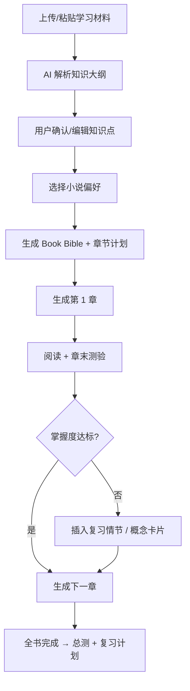

# Custom Book — 产品需求文档（PRD）

## 1. 产品愿景

**一句话**：把任意学习材料，生成一本「你喜欢的类型 + 你设定的主角」的连载小说，并在阅读中完成理解与记忆。

### 目标用户

| 人群 | 痛点 | 价值 |
|------|------|------|
| 大学生 / 自学者 | 教材枯燥、看不进去 | 用熟悉叙事框架降低认知门槛 |
| 考证 / 职场充电 | 时间碎片化 | 短章节 + 章末测验，适合通勤 |
| 教师 / 培训者 | 需要差异化教学材料 | 同一知识点生成多风格版本 |
| 深度阅读爱好者 | 想「学会」而非「读完」 | 情节绑定知识锚点 + 掌握度追踪 |

### North Star 指标

**概念掌握度提升 × 章节完成率**

辅助指标：7 日留存、章末测验正确率、多风格版本转化率。

---

## 2. 用户旅程

---

## 3. 功能模块

### Phase 0 — MVP（4～6 周）

| 模块 | 功能 | 优先级 |
|------|------|--------|
| 材料导入 | 粘贴文本、上传 PDF/TXT | P0 |
| 知识解析 | 自动提取章节、概念、定义、关系 | P0 |
| 偏好设定 | 题材、文风、主角、篇幅、语言 | P0 |
| Book Bible | 世界观、人物表、情节主线、知识映射表 | P0 |
| 章节生成 | 800～1500 字/章，带章末 3 题 | P0 |
| 阅读器 | 进度、书签、夜间模式 | P0 |
| 测验 | 选择/填空/简答，即时反馈 | P0 |
| 掌握度 | 每概念 0～100，影响下一章 | P0 |
| 知识对照 | 本章「故事段落 ↔ 原文知识点」 | P1 |

### Phase 1 — 增长与留存

- 连载推送（每日/每周新章提醒）
- 多版本（同一知识换题材）
- Spaced Repetition（前情回忆章）
- 导出 EPUB / PDF / Markdown
- 模板市场（社区分享叙事模板）

### Phase 2 — 平台化

- 创作者工具（教师批量生成班级版）
- 协作共读与讨论
- TTS 有声书
- LMS / 企业培训 API

---

## 4. 关键页面

1. **Onboarding** — 导入 → 选风格 → 预览大纲
2. **Book Dashboard** — 进度环、掌握度雷达、下一章
3. **Reader** — 正文 + 侧边「本章知识点」
4. **Quiz Sheet** — 章末测验 + 解析
5. **Knowledge Map** — 概念图谱 + 薄弱点高亮
6. **Settings** — 文风微调、重新生成某章

---

## 5. 非功能需求

| 类别 | 要求 |
|------|------|
| 准确性 | 每章绑定 source chunks，支持引用跳转 |
| 延迟 | 首章 < 60s（流式输出） |
| 成本 | 按章计费，大纲缓存复用 |
| 安全 | 用户材料私有，不用于训练（可配置） |
| 合规 | 13 岁以下需家长模式 |

---

## 6. MVP 验收标准

- 10 位内测用户完成 ≥ 5 章闭环
- 章末测验概念相关题正确率 ≥ 70%
- 用户主观评分「比原教材更好读」≥ 4/5
- 单章生成事实性错误人工抽检 ≤ 10%

---

## 7. 风险与对策

| 风险 | 对策 |
|------|------|
| 知识点讲错 | RAG + 段级校验 + 用户报告错误 → 重写 |
| 故事好看但学不到 | 强制 anchored_units + 章末应用题 |
| 生成太慢 | 流式 + 预生成下一章 + 大纲缓存 |
| 版权 | ToS：仅限个人学习；不公开分享未经授权全文 |
| 同质化 | 深耕长篇连载 + 掌握度 + 多风格切换 |
